# Automation Design

**Architecture diagrams for RPA, AI agents, and hybrid automation systems.**

A visual language for enterprise automation: robots, agents, humans, queues, orchestrators, business systems, and the boundaries between them — drawn as editorial, self-contained HTML/SVG diagrams that match your brand.

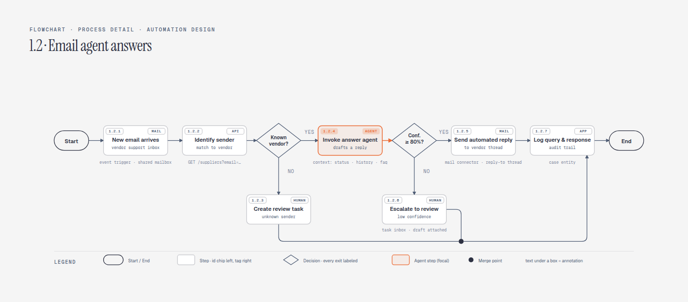

*One numbered process at the depth a PDD is written: step IDs that match the document's sections, technical facts annotated under each box, and the agent step with its confidence gate as the focal decision. Source: [`example-process-detail.html`](skills/automation-design/assets/example-process-detail.html).*

11 visual types, 18 semantic patterns — 11 of them automation-specific. One agent skill for Claude Code, Codex, and Pi. Semantic patterns describe behavior separately from layout: a dispatcher/queue/performer topology, an agent→RPA handoff, or a human-in-the-loop approval each routes to the nearest existing visual type instead of inventing a new one. Static HTML remains the default; optional motion is available for ordered explanations. The skill also redraws draw.io or Mermaid sources at a chosen format, size, and detail level.

Forked from [cathrynlavery/diagram-design](https://github.com/cathrynlavery/diagram-design) (MIT) — the editorial design system, verification tooling, and import/export pipeline come from there; the automation vocabulary, patterns, and scope are new.

---

## What makes it different

Most diagram generators arrange boxes. This skill understands the domain first:

> *"Make the architecture of an automation where invoices arrive in Outlook, a Dispatcher queues them, a Performer processes the document, requests human approval, and posts to SAP."*

routes to `Dispatcher / queue / performer` + `Human-in-the-loop approval`, loads the vendor-neutral vocabulary, and draws `Outlook → Dispatcher → Queue → Performer → Approval → SAP` with consistent conventions:

- **Class is always visible** — the reader can tell script from reasoning from judgment at a glance. Topology diagrams badge the actor (`⚙ RPA` deterministic, `✦ AGENT` agentic, `◉ HUMAN` judgment, untagged systems); workflow diagrams tag each step with the system that executes it, from one closed set of eight (`MAIL`, `DOC AI`, `AGENT`, `HUMAN`, `RPA`, `API`, `APP`, `QUEUE`).
- **Vendor-neutral primitives** — the concept is `Queue`, never `UiPath Orchestrator Queue`; platform names live in sublabels, so one visual language covers every client stack.
- **Automation boundaries** — network, credential, approval, and agent-permission boundaries are drawn explicitly, so a diagram never implies an agent can touch everything.

The 11 automation patterns: dispatcher/queue/performer, attended automation handoff, transaction lifecycle with retry and exceptions, human-in-the-loop approval, document processing pipeline, agent with tools, agent→RPA handoff, supervisor and worker agents, agent memory and evaluation loop, automation guardrails and boundaries, and the RPA solution blueprint — the PDD/SDD high-level view: named processes, decisions, human validation, and queue handoffs on one canvas. Full definitions in [`semantic-patterns.md`](skills/automation-design/references/semantic-patterns.md) and [`automation-primitives.md`](skills/automation-design/references/automation-primitives.md).

### Three altitudes, one visual language

A solution-design document needs the same automation drawn at more than one depth. The skill treats that as a first-class distinction rather than one diagram stretched to fit:

| Altitude | Question it answers | Pattern → type |
|---|---|---|
| **Executive overview** | Who does what, on which side of the org? | Dispatcher / queue / performer → **Data flow** |
| **Solution blueprint** | How do the processes fit together end to end? | RPA solution blueprint → **Flowchart**, phased |
| **Process detail** | What exactly does step 1.2.4 do, and against which endpoint? | RPA solution blueprint → **Flowchart**, process-detail |

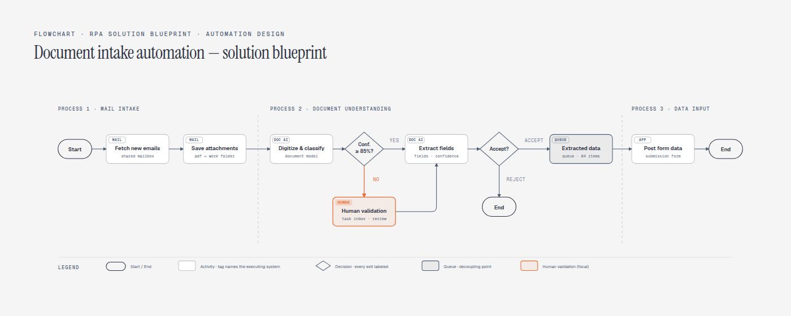

*Solution-blueprint altitude: the whole automation on one canvas, phase by phase — activities tagged by executing system, every decision exit labeled, the human-validation branch focal, and the queue as the visible decoupling point. Source: [`example-rpa-blueprint.html`](skills/automation-design/assets/example-rpa-blueprint.html).*

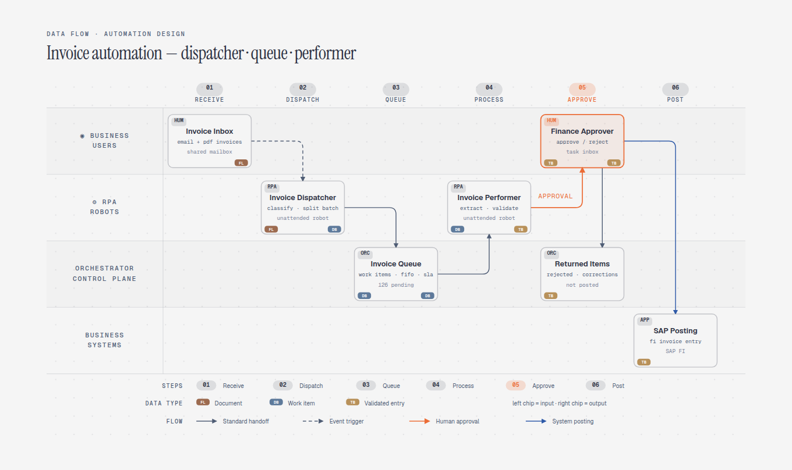

*Executive-overview altitude: the same class of automation by role lane rather than by workflow logic — useful when the audience cares who owns each stage, not which endpoint is called. Source: [`example-invoice-automation.html`](skills/automation-design/assets/example-invoice-automation.html).*

All three are vendor-neutral: they work for UiPath, Power Automate, Automation Anywhere, or a hand-rolled stack, because the tag names the system *class* and the product name lives in the sublabel. Already have these as draw.io PDDs? `/automation-design:import-drawio` redraws them in this system, with a fidelity ledger.

---

## What it makes

All 11 visual types ship in three static variants: minimal light, minimal dark, and full-editorial. Open any of them directly in a browser. There is no build step, JavaScript, or external image dependency.

<table>
<tr>
  <td align="center" width="33%">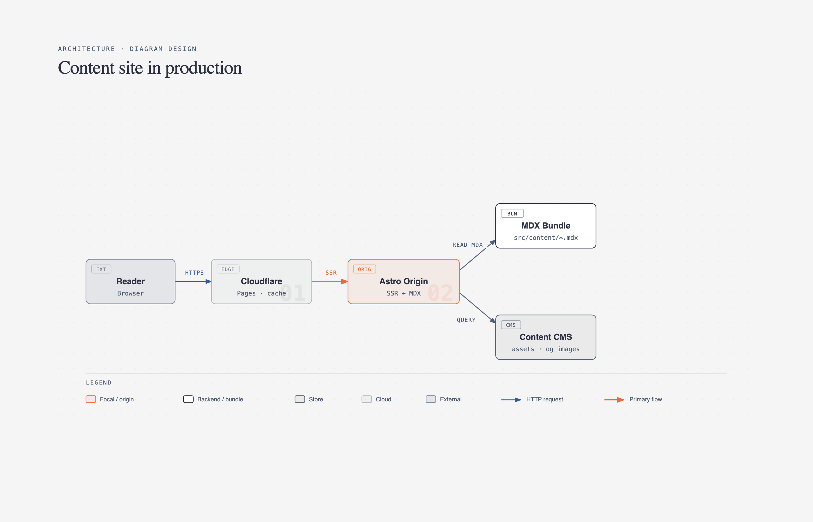<br><b>Architecture</b><br><sub>Agents, tools, robots, systems</sub></td>
  <td align="center" width="33%">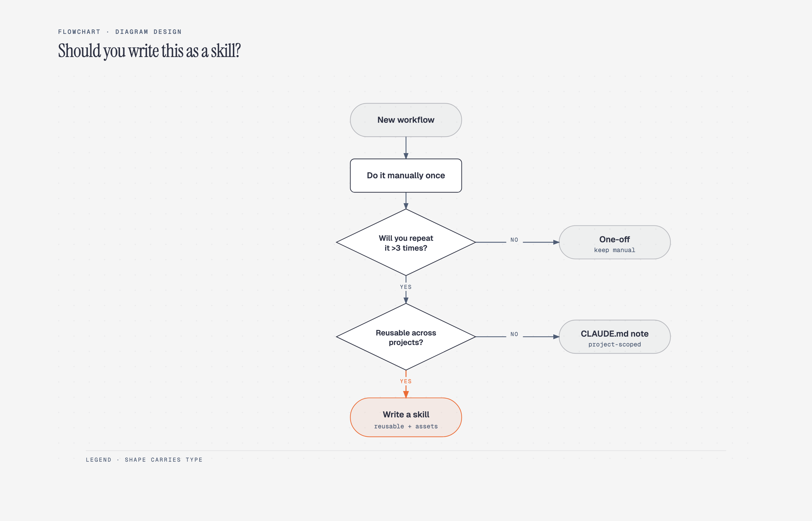<br><b>Flowchart</b><br><sub>Decision logic</sub></td>
  <td align="center" width="33%">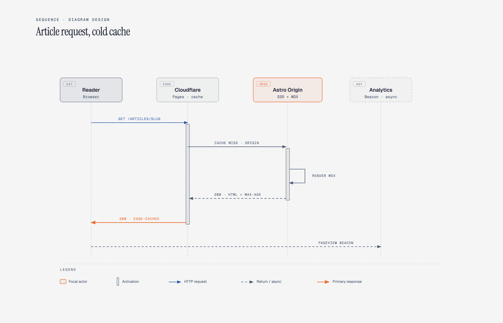<br><b>Sequence</b><br><sub>Agent/robot/human interplay</sub></td>
</tr>
<tr>
  <td align="center">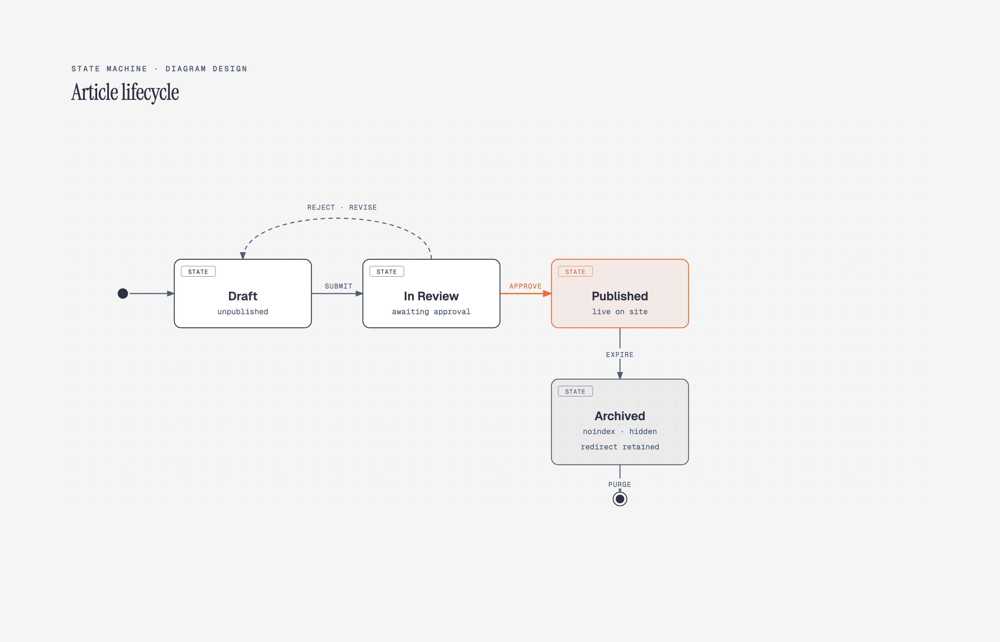<br><b>State machine</b><br><sub>Transaction lifecycles</sub></td>
  <td align="center">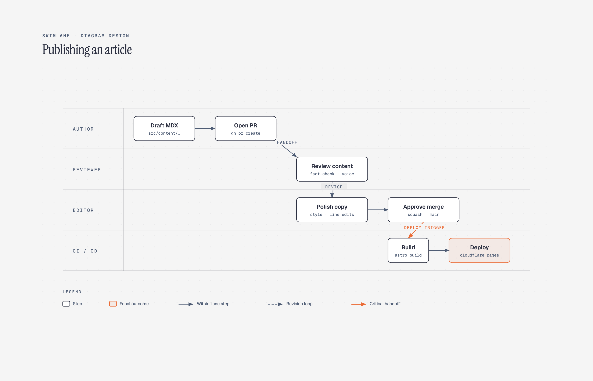<br><b>Swimlane</b><br><sub>Human/robot handoffs</sub></td>
  <td align="center">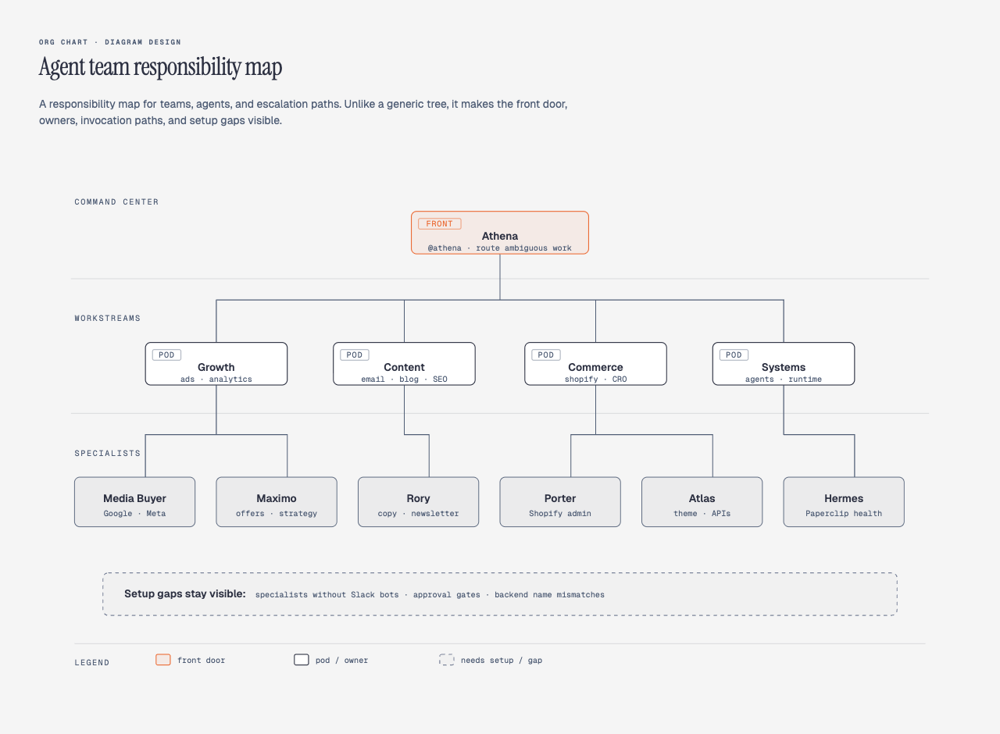<br><b>Org chart</b><br><sub>Supervisor + worker agents</sub></td>
</tr>
<tr>
  <td align="center">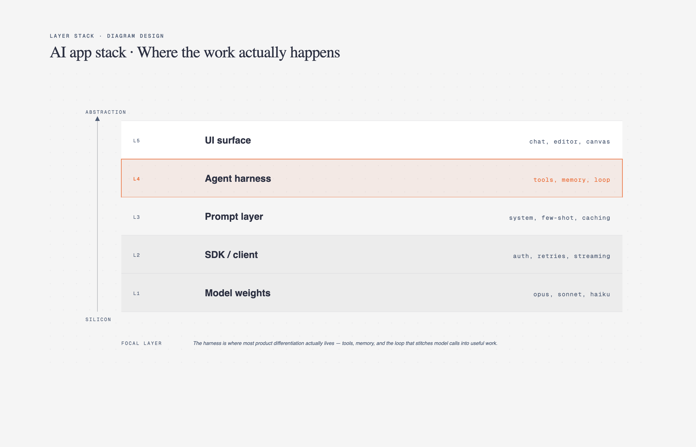<br><b>Layer stack</b><br><sub>Guardrails + governance</sub></td>
  <td align="center">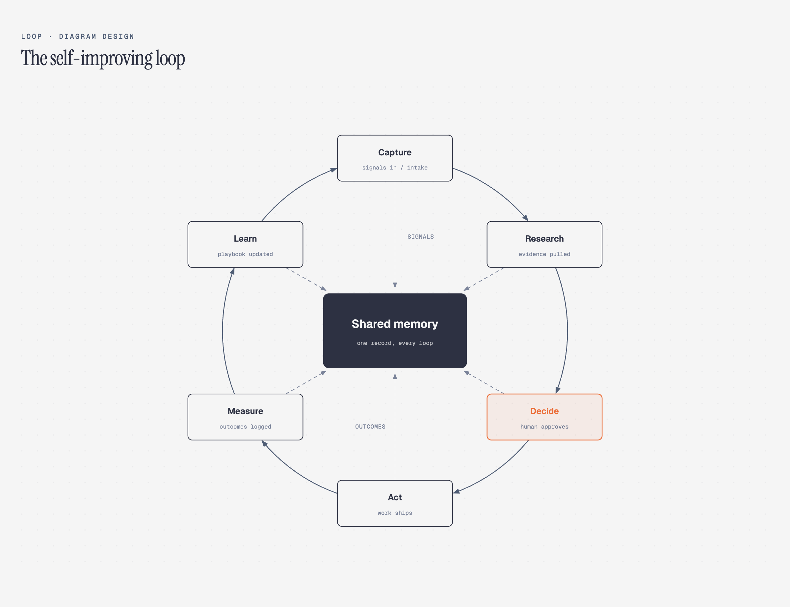<br><b>Loop</b><br><sub>Agent memory flywheel</sub></td>
  <td align="center">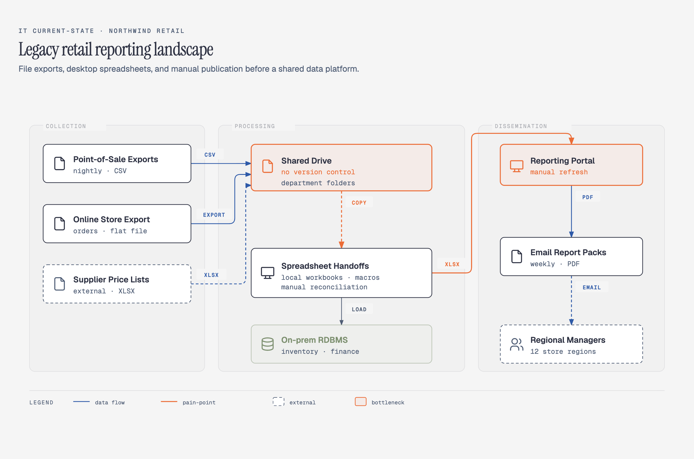<br><b>IT current-state</b><br><sub>The landscape before automation</sub></td>
</tr>
<tr>
  <td align="center">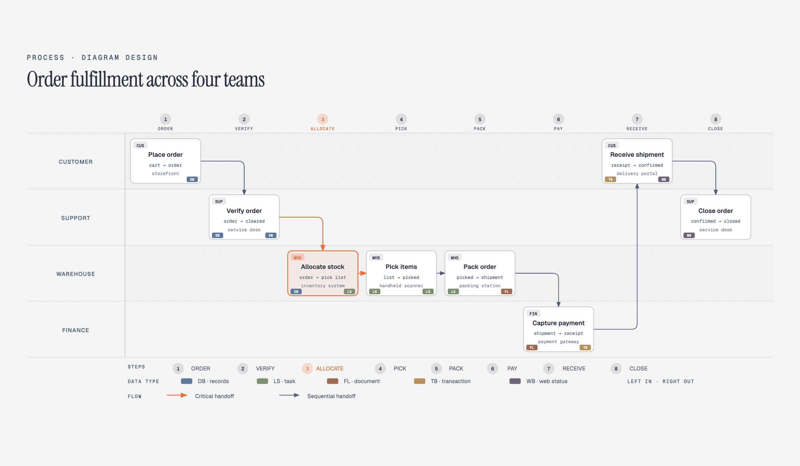<br><b>Process</b><br><sub>Multi-actor sequential workflow</sub></td>
  <td align="center">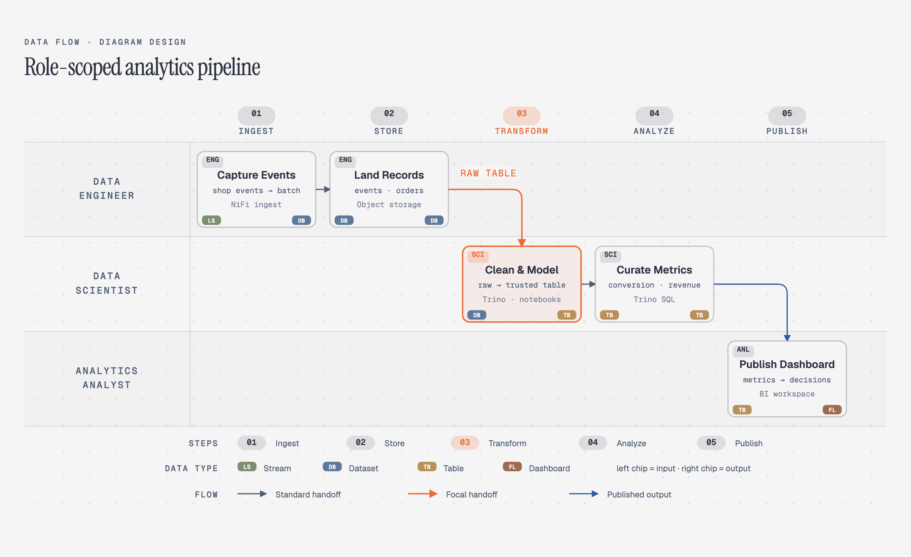<br><b>Data flow</b><br><sub>Dispatcher → queue → performer</sub></td>
  <td></td>
</tr>
</table>

**Browse the gallery locally:** open [`skills/automation-design/assets/index.html`](skills/automation-design/assets/index.html) to flip through all 11 types with light / dark / full-editorial tabs.

---

## Install

**Claude Code:**

```text
/plugin marketplace add dragospadurariu/automation-diagram-design-skill
/plugin install automation-design@automation-design
```

**Codex:**

```bash
codex plugin marketplace add dragospadurariu/automation-diagram-design-skill
codex plugin add automation-design@automation-design
```

**Pi:**

```bash
pi install https://github.com/dragospadurariu/automation-diagram-design-skill
```

Run `/reload` in an open Pi session. Pi loads the `/export-diagram`, `/import-mermaid`, and `/profile` prompt templates alongside the skill.

### Editable install

Managed installs are convenient, but changes to `references/style-guide.md` may be replaced by package updates. Saved profiles in `~/.automation-design/profiles/` survive updates, and projects with a `.automation-design` marker are unaffected. Clone the repo and install the local path if you plan to customize the working style guide directly:

```bash
git clone https://github.com/dragospadurariu/automation-diagram-design-skill.git ~/code/automation-design

# Pi: register the checkout as a local package
pi install ~/code/automation-design

# Claude Code: symlink the inner skill
ln -s ~/code/automation-design/skills/automation-design ~/.claude/skills/automation-design
```

The shared skill lives at `skills/automation-design/`. Pi discovers it through the repo's standard `skills/` package directory; Claude Code, Codex, and other Agent Skills-compatible tools use the same files.

---

## Onboarding — make it look like *your* brand

Out of the box, diagrams render in a clean **jet-black + atomic-tangerine** palette. Good enough to screenshot straight away. But 60 seconds of onboarding is better — the skill pulls your brand from your website and applies it across every diagram.

```
You:     "onboard automation-design to https://yoursite.com"
Agent:   → fetches the homepage
         → extracts the dominant palette + font stack
         → maps detected values to semantic roles:
             paper, ink, muted, accent, link
         → shows a proposed diff
         → writes your tokens to references/style-guide.md
You:     "yes, apply it"
```

Brand matching emits a fidelity receipt: sampled URLs, exact color roles, font families and weights, font source URLs, and any fallback. Contrast is verified (WCAG AA on `ink` over `paper`) before tokens are written. On first use in a new project the skill pauses and asks before shipping default-skinned output. See [`skills/automation-design/references/onboarding.md`](skills/automation-design/references/onboarding.md) for the full spec.

### Working with multiple clients

Onboard a brand once, save the result as a named profile, then add a `.automation-design` marker containing `profile: <slug>` to each client project. Marker projects read `~/.automation-design/profiles/<slug>.md` directly, so parallel workspaces can use different brands without overwriting a shared installed `style-guide.md`. Use `/automation-design:profile` in Claude Code, `/profile` in Pi, or ask in natural language. See [`profiles.md`](skills/automation-design/references/profiles.md) for the storage, marker, and recovery contract.

---

## Quickstart

```bash
# From a cloned checkout, open the gallery
open skills/automation-design/assets/index.html       # macOS
xdg-open skills/automation-design/assets/index.html  # Linux

# In Claude Code, Codex, or Pi, ask:
# "Draw the architecture of my invoice automation: Outlook trigger, dispatcher,
#  queue, performer, human approval, SAP."
# "Diagram an agent that reads a ticket, picks the right RPA process, and
#  escalates failures to a human."
# "Show the transaction lifecycle with retries and business/system exceptions."
# "Draw process 1.2 in PDD detail: email in, identify the vendor, agent drafts a
#  reply, send it if confidence is over 80%, otherwise escalate to review."
```

Your agent picks the semantic pattern, then the visual type, builds the HTML, and saves it. You can also start from a template directly:

```bash
cp skills/automation-design/assets/template.html my-diagram.html        # minimal light
cp skills/automation-design/assets/template-full.html my-diagram.html   # editorial with summary cards
cp skills/automation-design/assets/template-motion.html my-diagram.html # optional accessible motion
```

### Semantic patterns and optional motion

When behavior matters, the skill chooses a semantic pattern first and a visual type second. Eighteen routed patterns: seven general (fan-in queues, stage slots, unstructured-input transformation, paired policy traces, secure paved roads, governance catalogs, compensating security layers) and eleven automation-specific (listed above). Each defines its triggers, primitives, budget, anti-patterns, static fallback, and nearest visual type in [`semantic-patterns.md`](skills/automation-design/references/semantic-patterns.md).

Motion is optional and does not create another visual type. [`animation.md`](skills/automation-design/references/animation.md) defines `none`, `reveal`, `step`, and `loop` modes with a complete static first frame, deterministic timing, and controls when interaction is available. Reduced-motion output shows the complete static frame and hides/disables playback controls. The default is `none`: ordinary output remains static and script-free. [`example-policy-trace-animated.html`](skills/automation-design/assets/example-policy-trace-animated.html) is the self-contained interactive example.

---

## Import from draw.io or Mermaid

Already have automation diagrams in draw.io / diagrams.net or Mermaid? Point the skill at the source and it **redraws** them — same content, this design system, at whatever the destination needs.

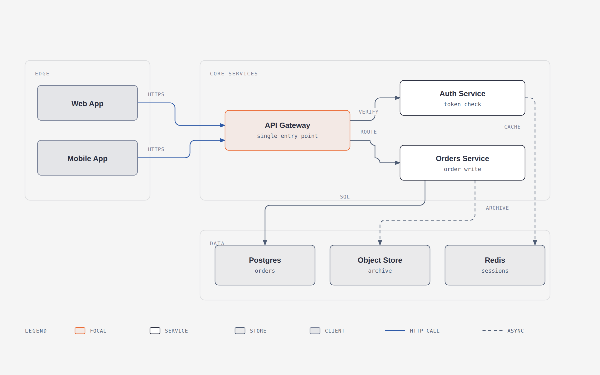

```
/automation-design:import-drawio platform.drawio
/automation-design:import-drawio platform.drawio --size=slide-16x9 --detail=simplified --audience=executive
/automation-design:import-mermaid README.md --diagram=all
/automation-design:import-mermaid process.mmd --size=slide-16x9 --detail=simplified
```

| Dial | Options | What it changes |
|---|---|---|
| **Format** | `html` · `svg` · `png` · `html+png` | The deliverable. SVG for Figma, PNG for slides, HTML for the web. |
| **Size** | `doc-inline` · `doc-wide` · `slide-16x9` · `slide-4x3` · `social-og` · `social-square` · `print-a4-landscape` · `print-a3-landscape` · `print-letter-landscape` · `fit` | The `viewBox` **and the type ramp**. |
| **Detail** | `faithful` (≤24 nodes, zoned) · `balanced` (≤12) · `simplified` (≤7) | How much of the source survives. |
| **Audience** | `engineer` · `mixed` · `executive` | The *wording*, not the count. |

Every import ends with a **fidelity ledger** — what got merged, collapsed, or dropped. See [`references/import-drawio.md`](skills/automation-design/references/import-drawio.md), [`references/import-mermaid.md`](skills/automation-design/references/import-mermaid.md), and [`references/output-spec.md`](skills/automation-design/references/output-spec.md).

---

## Export to PNG / SVG

```
/automation-design:export-diagram path/to/diagram.html
/automation-design:export-diagram path/to/diagram.html --svg-only
/automation-design:export-diagram path/to/diagram.html --png-only --scale=3
```

- **SVG** — extracts the `<svg>` node and injects Google Fonts so it renders standalone in browsers, Figma, and Illustrator.
- **PNG** — rasterizes via Playwright at 2× by default. One-time setup: `pip install playwright && playwright install chromium`.

See [`skills/automation-design/references/export.md`](skills/automation-design/references/export.md) for the full procedure.

---

## Architecture

Progressive disclosure. `SKILL.md` routes behavior first when needed, then layout. Semantic, type, and animation references load only when relevant.

```
automation-design/
├── .agents/plugins/marketplace.json — Codex marketplace catalog
├── .claude-plugin/                  — Claude marketplace + plugin manifest
├── .codex-plugin/                   — Codex plugin manifest
├── commands/
│   ├── export-diagram.md            — Claude Code export command
│   ├── import-drawio.md             — Claude Code draw.io import command
│   ├── import-mermaid.md            — Claude Code Mermaid import command
│   └── profile.md                   — Claude Code client-profile command
├── prompts/
│   ├── export-diagram.md            — Pi `/export-diagram` prompt template
│   ├── import-mermaid.md            — Pi Mermaid import prompt template
│   └── profile.md                   — Pi `/profile` prompt template
├── skills/
│   └── automation-design/
│       ├── SKILL.md                 — philosophy, selection guide, checklist
│       ├── references/              — loaded only when a type or primitive is chosen
│       │   ├── style-guide.md       — single source of truth for colors + fonts
│       │   ├── automation-primitives.md — vendor-neutral automation vocabulary
│       │   ├── semantic-patterns.md — behavior patterns independent of layout
│       │   ├── animation.md         — optional motion + accessibility contract
│       │   ├── onboarding.md        — the URL-to-tokens flow
│       │   ├── profiles.md          — named client profiles + project markers
│       │   ├── import-drawio.md     — draw.io redraw procedure
│       │   ├── import-mermaid.md    — Mermaid redraw procedure
│       │   ├── output-spec.md       — format × size × detail level
│       │   ├── export.md            — SVG / PNG export + sizing
│       │   ├── type-architecture.md
│       │   ├── type-flowchart.md
│       │   ├── type-sequence.md
│       │   ├── type-state.md
│       │   ├── type-swimlane.md
│       │   ├── type-org-chart.md
│       │   ├── type-layers.md
│       │   ├── type-loop.md
│       │   ├── type-process.md
│       │   ├── type-data-flow.md
│       │   ├── type-it-state.md
│       │   ├── primitive-annotation.md
│       │   ├── primitive-sketchy.md
│       │   └── primitive-terminal.md
│       ├── scripts/
│       │   ├── drawio_extract.py    — draw.io → structured IR
│       │   ├── mermaid_extract.py   — Mermaid → structured IR
│       │   └── self_check.py        — packaged output self-check (runs installed)
│       └── assets/
│           ├── index.html           — live gallery, tabbed
│           ├── template*.html       — scaffolds for new diagrams
│           ├── example-<type>.html  — 3 variants × 11 types
│           ├── example-process-detail.html   — PDD-depth flagship
│           ├── example-rpa-blueprint.html    — phased-blueprint flagship
│           ├── example-invoice-automation.html — overview flagship
│           ├── example-loop-terminal.html
│           ├── example-import-drawio.html
│           ├── example-import-mermaid.html
│           ├── example-policy-trace-animated.html
│           └── example-sequence-oauth*.html
├── scripts/
│   ├── bump-plugin-version.py       — synchronized Claude/Codex version bump
│   ├── verify-plugin-package.py     — version + marketplace package gate
│   ├── test-plugin-package.py       — adversarial package-gate tests
│   ├── test-verify-docs-sync.py     — docs/profile-surface gate tests
│   └── fixtures/
│       ├── sample-flowchart.mmd
│       ├── sample-readme-with-mermaid.md
│       └── sample-adversarial.mmd
├── docs/adr/                        — short records of settled design decisions
└── docs/screenshots/                — images used in this README
```

This keeps the agent's working context tight: routine diagrams load one type reference; behavior-rich diagrams add the routed semantic reference plus the automation vocabulary; animation adds its contract only when selected.

### Contributing / validation gates

Before submitting a new example, run `python3 scripts/lint-skin.py <your-new-example.html>`.
The repository-wide check `python3 scripts/lint-skin.py --all --baseline` covers examples and templates and must stay green.
Semantic routing must pass `python3 scripts/verify-semantic-motion.py --markdown-only`; the animated example has a separate `--example-only` gate. Every shipped motion template/example must also pass `python3 scripts/verify-motion.py --shipped`.
If you touch the draw.io import path, `python3 scripts/verify-drawio-import.py` must also pass; the Mermaid path is gated by `python3 scripts/verify-mermaid-import.py`.
Label placement is gated geometrically: `python3 scripts/verify-geometry.py --all` fails CI when a label mask overlaps a node declared later in the document. `python3 scripts/test-verify-geometry.py` keeps that checker honest in both directions.
Docs and routing surfaces are themselves gated: `python3 scripts/verify-docs-sync.py` fails CI if the SKILL.md description loses a type's lexical hook, the gallery can't reach a shipped example, the README tree names a file that doesn't exist, a relative `references/*.md` link in SKILL.md is broken, a reference file links to a sibling that doesn't exist, or the Claude/Pi profile surfaces drift from `profiles.md`. `python3 scripts/test-verify-docs-sync.py` exercises those checks adversarially. The skill also ships `skills/automation-design/scripts/self_check.py` — a distilled output checker installed agents can run on their own generated diagrams; `python3 scripts/test-self-check.py` keeps it honest. Settled design decisions live as short ADRs in `docs/adr/` — read them before relitigating one, add one when you settle a new policy.

All pull requests and pushes are automatically validated across Linux, Windows, and macOS runners via GitHub Actions CI (`.github/workflows/ci.yml`).

### What loads when

| You ask for… | Agent loads |
|---|---|
| "Draw my invoice automation with a dispatcher and a queue" | `SKILL.md` + `references/semantic-patterns.md` + `references/automation-primitives.md` + `references/type-data-flow.md` |
| "Diagram my agent and its tools" | `SKILL.md` + `references/semantic-patterns.md` + `references/automation-primitives.md` + `references/type-architecture.md` |
| "Make me a flowchart" | `SKILL.md` + `references/type-flowchart.md` |
| "Animate that queue" | Prior selection + `references/animation.md` |
| "Onboard this skill to my site" | `SKILL.md` + `references/onboarding.md` + `references/style-guide.md` |
| "Use my saved Acme client profile" | `SKILL.md` + `references/profiles.md` + `~/.automation-design/profiles/acme.md` |
| "Redraw this .drawio file for my deck" | `SKILL.md` + `references/import-drawio.md` + `references/output-spec.md` + the chosen type's reference |

No matter how many types exist, the agent only reads the one you need.

---

## The design system (in one paragraph)

One accent color, 1–2 focal elements per diagram. Three font families: Instrument Serif (title + italic callouts), Geist sans (node names), Geist Mono (technical sublabels). 1px hairline borders, no shadows, max border-radius 10px. Every coord, width, and gap divisible by 4. Badges (`⚙ RPA` / `✦ AGENT` / `◉ HUMAN`) separate deterministic, agentic, and human actors; automation boundaries make permissions visible. Full spec in [`SKILL.md`](skills/automation-design/SKILL.md#5-design-system) and [`automation-primitives.md`](skills/automation-design/references/automation-primitives.md).

## When *not* to use this skill

- **Quick unicode diagrams** for tweets or terminal output → wiretext-style skill.
- **Lists of anything** → a table or bullets.
- **Before/after comparisons** → a table.
- **One-shape "diagrams"** — a single box with a label → just write the sentence.

---

## Contributing

Contributions are welcome — new automation patterns, vendor packs, import grammar support, examples, docs, and tooling. See [CONTRIBUTING.md](CONTRIBUTING.md) for the validation gates and workflows, and [CODE_OF_CONDUCT.md](CODE_OF_CONDUCT.md) for community standards.

## Credits & license

MIT. Forked from [diagram-design](https://github.com/cathrynlavery/diagram-design) by [Cathryn Lavery](https://github.com/cathrynlavery) — the editorial design system, style-guide/profile machinery, import/export pipeline, icon set, and verification tooling originate there. Automation vocabulary, semantic patterns 8–18, and the automation scope by Dragos Padurariu. Icons: [Tabler Icons](https://tabler.io/icons) (MIT), [Simple Icons](https://simpleicons.org) (CC0) — see [THIRD_PARTY_LICENSES.md](THIRD_PARTY_LICENSES.md).
